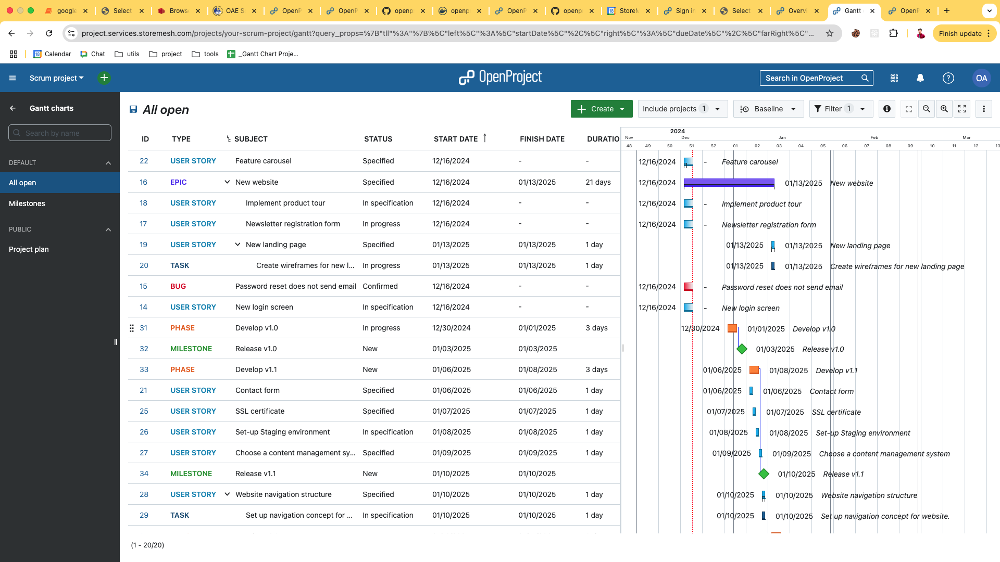

# OpenProject
- edit `.env`
```bash
OPENPROJECT_HOST__NAME=localhost:8080 # in production eg. project.services.storemesh.com
OPENPROJECT_HTTPS=false # in production SET to true
```

- compose up
    ```bash
    docker compose up
    ```

    - at first time web maybe stop before seeding sucess -> start web again

- open browser http://localhost:8080

